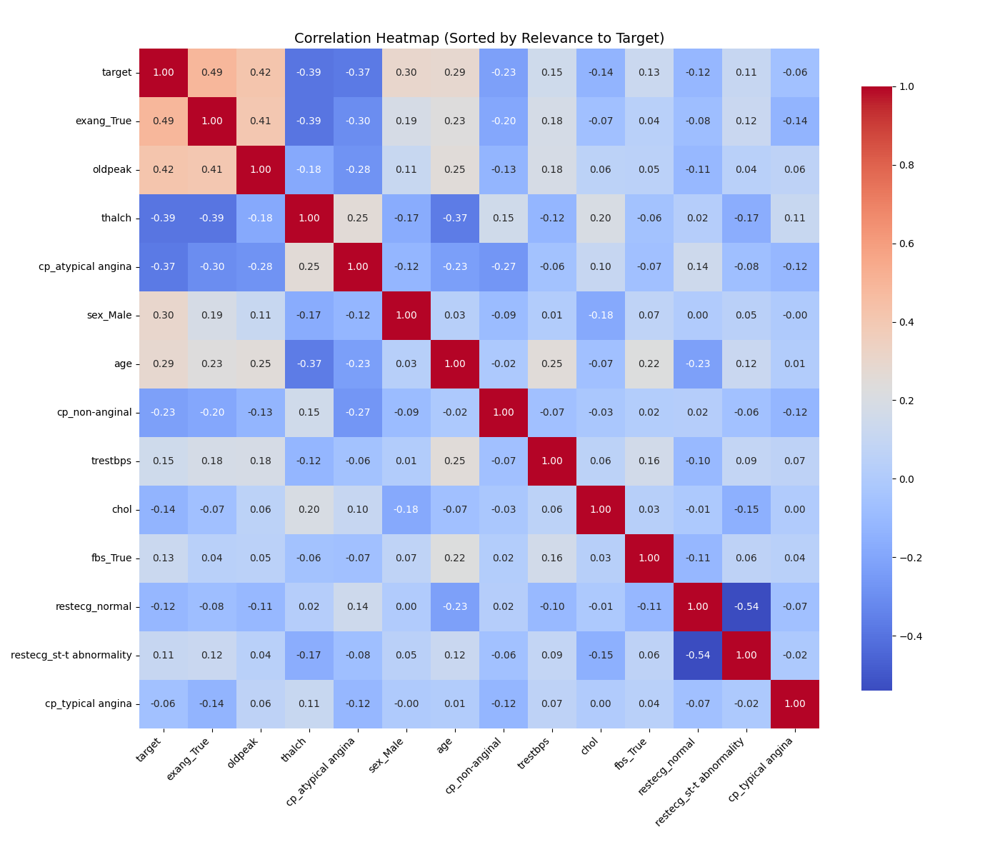

# 🫀 Heart Disease Risk Prediction

**Exploring Key Risk Factors and Building an Interpretable ML Model for Early Heart Disease Detection**

---

## 📌 Overview

This project analyzes clinical data to uncover patterns in heart disease risk factors and builds a predictive model using Python. The aim is to simplify complex healthcare data into meaningful insights and actionable predictions that support early intervention.

---

## 🚨 Purpose

Heart disease remains the leading cause of death globally. Identifying early risk indicators through data can save lives. This project focuses on four key questions:

- Which clinical features most strongly correlate with heart disease?
- How do risk patterns differ across sex, age, and other variables?
- Can we build an interpretable model that predicts risk with high accuracy?
- What insights can help doctors and policy-makers prioritize interventions?

The approach blends statistical EDA with machine learning to go beyond charts — toward predictive understanding.

---

## 💾 Dataset Details

- **Source:** [Kaggle – Heart Disease UCI](https://www.kaggle.com/datasets/johnsmith88/heart-disease-dataset)
- **File Used:** `data/heart.csv` → cleaned to `heart_cleaned.csv`
- **Size:** 920 original rows, 740 rows after cleaning
- **Tool Used:** Python (pandas, seaborn, sklearn, joblib)

---

## 🧠 Insights Summary

### 1️⃣ Risk Factor Patterns (EDA)

- **Sex:** Males showed higher rates of heart disease compared to females.
- **Chest Pain Type:** 'Asymptomatic' and 'Non-anginal' types are strongly associated with disease.
- **Exercise-induced Angina (exang):** Clear positive correlation with disease presence.
- **ST Depression (oldpeak):** Higher values strongly align with heart disease cases.
- **Max Heart Rate (thalch):** Lower max HR is associated with increased risk.

### 2️⃣ Correlation with Target

| Feature                 | Correlation |
|-------------------------|-------------|
| `exang_True`            | +0.49        |
| `oldpeak`               | +0.41        |
| `cp_atypical angina`    | –0.37        |
| `thalch`                | –0.39        |
| `sex_Male`              | +0.30        |

These insights guided feature selection and model interpretation.

### 3️⃣ Best Model – Logistic Regression

| Model               | Accuracy | F1 Score | Recall |
|--------------------|----------|----------|--------|
| Logistic Regression | ✅ 83.1%  | ✅ 0.84   | ✅ 87%  |
| Random Forest       | 80.4%    | 0.81     | 82%    |
| XGBoost             | 79.0%    | 0.80     | 81%    |

✅ Logistic Regression was selected for its strong balance of performance and interpretability — critical in healthcare applications.

---

## 📊 Visual Insights

### 🔍 Feature Correlation with Heart Disease

This heatmap highlights how various features relate to heart disease risk. Higher correlation values (positive or negative) reveal stronger relationships.



---

### 🫀 Chest Pain Type vs Disease Outcome

The type of chest pain shows a strong pattern: patients with "asymptomatic" or "non-anginal" pain are more likely to have heart disease.


---

### 🧠 Feature Importance (Logistic Regression)

The most interpretable model — Logistic Regression — shows how each factor contributes to predicting risk. Positive values increase risk; negative values are protective.


---

## 🛠️ Project Structure

```
HeartDisease_Risk_EDA/
├── data/
│   ├── heart.csv                   # Raw dataset
│   └── heart_cleaned.csv          # Cleaned, preprocessed data
├── scripts/
│   ├── eda_step1_load_info.py     # Data load + info
│   ├── eda_step2_cleaning.py      # Cleaning + missing values
│   ├── eda_step3_encode_corr.py   # Encoding + correlation
│   ├── eda_step4_visuals.py       # Risk factor plots
│   ├── eda_step5_model.py         # ML models & results
│   ├── eda_step6_feature_importance.py  # Coefficient plot
│   └── eda_step7_save_model.py    # Save model + columns
├── outputs/
│   ├── plots/                     # EDA + model visuals
│   └── models/                    # Saved model (.pkl)
├── README.md                      # You’re here!
└── outputs/summary.txt            # Insight highlights
```

---

## 🚀 Tools & Workflow

- **Languages/Libraries:** Python, pandas, seaborn, matplotlib, scikit-learn, XGBoost
- **Model Persistence:** Saved using `joblib` for reuse and deployment
- **Version Control:** Git + GitHub
- **Workflow:** Data cleaned → EDA → ML → Model saved → Insights documented

---

## 📌 What This Project Shows

- ✅ Real-world EDA on clinical data
- ✅ Risk factor interpretation with visual storytelling
- ✅ Classifier modeling (LogReg, RF, XGB)
- ✅ Deployment-ready model saving
- ✅ Healthcare context + practical narrative

---

## 👋 About Me

I enjoy solving real-world problems at the intersection of data and healthcare. This project demonstrates my ability to explore data, derive insights, and translate them into practical, interpretable models that can support decision-making in clinical contexts.

Still learning. Always improving.

---

## 👤 Author

**Varshita Yeddula**  
Data / BI Analyst  

📧 [varshitayeddula@gmail.com](mailto:varshitayeddula@gmail.com)  
🔗 [LinkedIn](https://www.linkedin.com/in/varshita-reddy-yeddula-45102b254)

---
